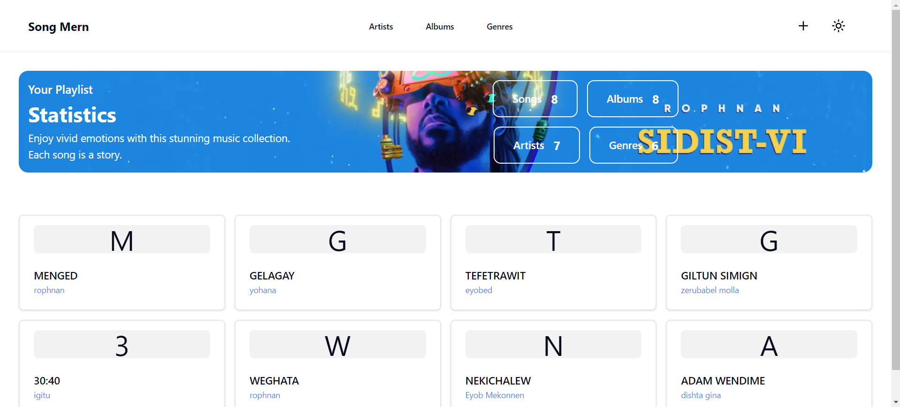

  

<h1 align="center">Song MERN</h1>

  <a href="https://songmern.netlify.app/">songmern.netlify.app</a>

### Getting Started

- [Frontend](./frontend/)
- [Backend](./backend/)

## License

This project is licensed under the [MIT](https://choosealicense.com/licenses/mit/) License
